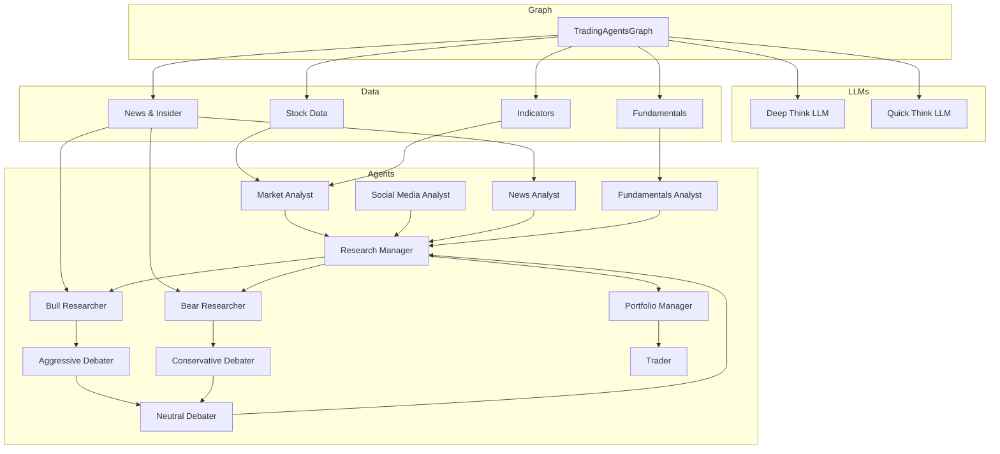

# TradingAgents Architecture Overview

This document provides a high‑level view of the **TradingAgents** framework, its core modules, and how they interact to produce a trading decision. It is intended for developers who want to understand the design before contributing or extending the system.

---

## 1. Project Structure

```
tradingagents/
├─ agents/                # LLM‑powered agent factories and utilities
│  ├─ analysts/           # Fundamental, market, news, social‑media analysts
│  ├─ researchers/        # Bull / Bear researchers
│  ├─ risk_mgmt/          # Aggressive / Conservative / Neutral debaters
│  ├─ managers/           # Research & Portfolio managers
│  ├─ trader/             # Trader agent
│  └─ utils/              # Shared utilities (state, memory, helpers)
├─ dataflows/             # Data‑access layer (AlphaVantage, yfinance, etc.)
├─ graph/                 # LangGraph orchestration
│  ├─ checkpointer.py
│  ├─ conditional_logic.py
│  ├─ propagation.py
│  ├─ reflection.py
│  ├─ signal_processing.py
│  ├─ setup.py
│  └─ trading_graph.py
├─ llm_clients/           # LLM provider wrappers
│  ├─ base_client.py
│  ├─ factory.py
│  ├─ openai_client.py
│  ├─ anthropic_client.py
│  ├─ azure_client.py
│  ├─ google_client.py
│  ├─ model_catalog.py
│  └─ validators.py
├─ default_config.py      # Default configuration dictionary
├─ main.py                # Example entry‑point
└─ ...
```

## 2. Core Concepts

| Concept | Description |
|---------|-------------|
| **Agent** | A stateless function that performs a specific task (e.g., fetch fundamentals, generate a sentiment report). Agents are created via factory functions in `tradingagents/agents/__init__.py`.
| **Debate** | Two‑party discussion between *bull* and *bear* researchers or *aggressive* and *conservative* risk debaters. The debate is orchestrated by `ConditionalLogic` and results in a *judge decision*.
| **Graph** | A LangGraph workflow that chains agents, debates, and decision‑making steps. The main entry point is `TradingAgentsGraph`.
| **LLM Client** | Thin wrapper around a provider (OpenAI, Anthropic, Google, etc.) that exposes a `get_llm()` method. Created via `create_llm_client` in `llm_clients/factory.py`.
| **Memory Log** | Persistent JSON log of past decisions and reflections stored under `~/.tradingagents/memory/trading_memory.md`. Used to provide context to the Portfolio Manager.
| **Checkpoint** | Optional per‑ticker SQLite checkpoint that allows a crashed run to resume from the last successful node.

## 3. Data Flow Overview



1. **Data Retrieval** – Tool nodes (`get_stock_data`, `get_indicators`, `get_fundamentals`, `get_news`, etc.) fetch data from the configured vendor (AlphaVantage or yfinance).
2. **Analyst Reports** – Each analyst agent consumes the relevant data and produces a report.
3. **Debate Phase** – Researchers debate the analyst reports. The debate is limited by `max_debate_rounds` and `max_risk_discuss_rounds`.
4. **Decision Phase** – The Portfolio Manager aggregates debate outcomes, adds memory context, and produces a *final trade decision*.
5. **Trader Execution** – The Trader agent formats the decision into an actionable plan.
6. **Post‑Processing** – `SignalProcessor` extracts the core signal, and `Reflector` generates a reflection for future runs.

## 4. Key Files & Their Roles

| File | Purpose |
|------|---------|
| `tradingagents/graph/trading_graph.py` | Orchestrates the entire workflow; creates LLM clients, tool nodes, and compiles the LangGraph. Handles checkpointing and memory‑log resolution.
| `tradingagents/graph/setup.py` | Builds the LangGraph nodes and edges.
| `tradingagents/graph/conditional_logic.py` | Implements debate logic and round limits.
| `tradingagents/graph/propagation.py` | Provides helper methods to create the initial state and run the graph.
| `tradingagents/graph/reflection.py` | Generates reflections based on final decisions and returns.
| `tradingagents/graph/signal_processing.py` | Extracts the core signal from the trader’s plan.
| `tradingagents/llm_clients/factory.py` | Factory for LLM clients; selects provider based on config.
| `tradingagents/agents/utils/agent_utils.py` | Abstract tool functions (`get_stock_data`, `get_fundamentals`, etc.) used by tool nodes.
| `tradingagents/agents/utils/agent_states.py` | Data classes for debate and risk states.
| `tradingagents/agents/utils/memory.py` | Handles reading/writing the persistent memory log.
| `tradingagents/default_config.py` | Default configuration dictionary; can be overridden by user.
| `main.py` | Example script that demonstrates how to instantiate `TradingAgentsGraph` and run a single analysis.

## 5. Extending the Framework

1. **Add a new data source** – Implement a new tool function in `agent_utils.py` and register it in `_create_tool_nodes`.
2. **Create a new agent** – Write a factory function in the appropriate sub‑package (e.g., `analysts/`) and expose it via `__all__`.
3. **Change debate logic** – Modify `ConditionalLogic` or create a new subclass.
4. **Swap LLM provider** – Update `DEFAULT_CONFIG` or pass a custom config to `TradingAgentsGraph`.

## 6. Running the Example

```bash
# Install dependencies
pip install .

# Run the example
python main.py
```

The script will produce a JSON log under `~/.tradingagents/logs/<TICKER>/TradingAgentsStrategy_logs/` and a reflection in the memory log.

---

For more detailed information, refer to the individual module docstrings and the README.
