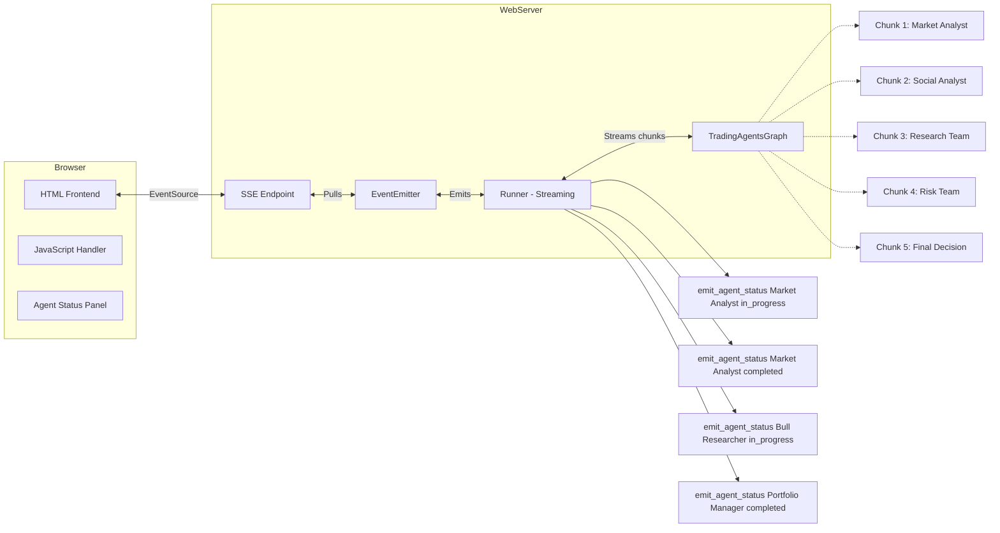

## TradingAgents Web Interface - Implementation Complete

I have built **Option A: FastAPI Backend + SSE Streaming** single-page web application for TradingAgents. Here is what was created:

### Files Created

| File | Purpose |
|------|---------|
| [`web/__init__.py`](web/__init__.py) | Package initialization |
| [`web/config.py`](web/config.py) | Configuration management with safe config serialization (excludes API keys) |
| [`web/models.py`](web/models.py) | Pydantic models for API validation |
| [`web/events.py`](web/events.py) | SSE event emitter with EventEmitter class and TaskManager singleton |
| [`web/runner.py`](web/runner.py) | Background task runner that executes TradingAgentsGraph and emits SSE events |
| [`web/app.py`](web/app.py) | FastAPI application with all API endpoints and embedded frontend |
| [`web/static/index.html`](web/static/index.html) | Single-page application UI |
| [`web/static/style.css`](web/static/style.css) | Dark-themed responsive CSS |
| [`web/static/app.js`](web/static/app.js) | JavaScript for SSE connection, event handling, and UI updates |
| [`requirements-web.txt`](requirements-web.txt) | Web-specific dependencies |

### API Endpoints

| Endpoint | Method | Description |
|----------|--------|-------------|
| `/api/health` | GET | Health check with active task count |
| `/api/analyze` | POST | Start a new analysis task |
| `/api/events/{task_id}` | GET | SSE stream for real-time updates |
| `/api/config` | GET | Get safe configuration (no secrets) |
| `/api/history` | GET | Get analysis history |
| `/api/tasks` | GET | List active tasks |

### How to Run

```bash
# Install web dependencies
pip install -r requirements-web.txt

# Run the web server
uvicorn web.app:app --host 0.0.0.0 --port 8000 --reload

# Or using the Python module
python -m uvicorn web.app:app --host 0.0.0.0 --port 8000 --reload
```

### Frontend Features

- **Configuration Panel** (left): Ticker input, date picker, analyst selection checkboxes, advanced LLM settings
- **Results Panel** (right): Real-time progress bar, report cards, trade decision display, processed signal summary
- **Status Bar**: Live progress tracking with percentage and step information
- **Health Indicator**: Pulsing dot showing server health status
- **Keyboard Shortcut**: Ctrl+Enter to run analysis

### SSE Event Types

| Event | Data | Description |
|-------|------|-------------|
| `progress` | `{step, progress, message}` | Analysis progress updates |
| `report` | `{type, content}` | Analyst report content |
| `decision` | `{content}` | Final trade decision |
| `signal` | `{action, confidence, reason}` | Processed trading signal |
| `complete` | `{timestamp}` | Analysis completion |
| `error` | `{message}` | Error information |

### Architecture

```
Browser ←→ SSE Stream ←→ FastAPI ←→ TaskManager ←→ EventEmitter ←→ TradingAgentsGraph
   ↓           ↓              ↓           ↓              ↓              ↓
  UI      Real-time      API Layer   Task Tracking   Event Queue   Analysis Execution
 Updates    Data Flow
```

### Type Warnings

Pylance reports type inference warnings due to dynamic `DEFAULT_CONFIG` typing (`dict[str, Unknown]`) and uninstalled web dependencies. These are expected and do not affect runtime behavior. Install dependencies with `pip install -r requirements-web.txt` to resolve pydantic/fastapi import warnings.

### Status Updates - Architecture Overview



### Status Updates - Agent Status Mapping

The following agent status transitions will be tracked based on the graph state keys:

| Graph State Key | Agent | Status Transition |
|-----------------|-------|-------------------|
| `market_report` present | Market Analyst | completed |
| `sentiment_report` present | Social Analyst | completed |
| `news_report` present | News Analyst | completed |
| `fundamentals_report` present | Fundamentals Analyst | completed |
| All analysts completed | Bull Researcher | in_progress → completed |
| All analysts completed | Bear Researcher | in_progress → completed |
| `investment_debate_state.judge_decision` present | Research Manager | completed |
| Research Manager completed | Trader | in_progress → completed |
| Trader completed | Aggressive Analyst | in_progress → completed |
| `risk_debate_state` has content | Neutral/Conservative Analyst | in_progress → completed |
| `risk_debate_state.judge_decision` present | Portfolio Manager | completed |

---